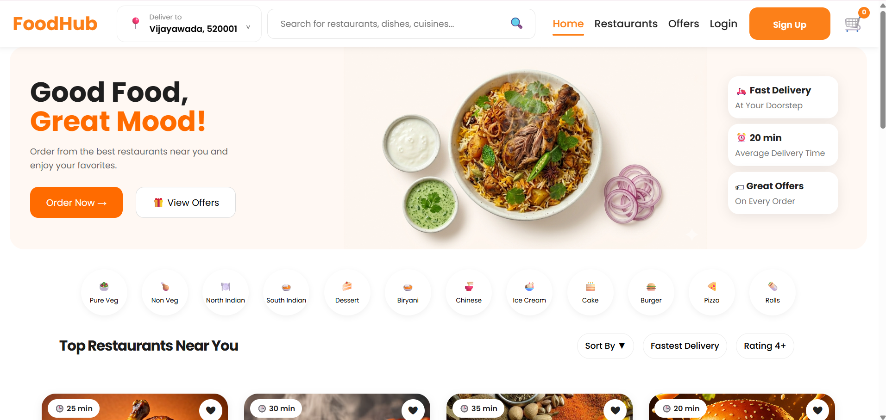

# 🍔 FoodHub - Full Stack Food Delivery Web Application

FoodHub is a full-stack online food delivery web application inspired by platforms like **Swiggy** and **Zomato**. It enables users to browse restaurants, explore menus, manage their cart, place orders, make secure online payments through **Razorpay**, and track their orders in real time.

The project is built using **Java, Servlets, JSP, JDBC, MySQL, HTML, CSS, JavaScript, and Apache Tomcat**, following a clean **3-Tier Architecture**.

---

## ✨ Features

### 👤 User Module
- User Registration & Login
- Session Management
- User Profile
- Logout

### 🍽️ Restaurant Module
- Browse Restaurants
- Restaurant Details
- Dynamic Menu
- Restaurant Ratings

### 🛒 Cart Module
- Add to Cart
- Update Quantity
- Remove Items
- Automatic Price Calculation
- GST & Delivery Charges
- Platform Fee

### 📍 Address Module
- Add Address
- Manage Addresses
- Select Delivery Address

### 💳 Payment Module
- Cash on Delivery (COD)
- Razorpay Payment Gateway Integration

### 📦 Order Module
- Place Order
- Order History
- Order Details
- Order Success Page

### 🚚 Order Tracking
- Swiggy-inspired Order Tracking
- Dynamic Status Timeline
- Pending
- Confirmed
- Preparing
- Picked Up
- Delivered

### 🎨 UI/UX
- Modern Responsive Design
- Swiggy-inspired Interface
- User-Friendly Navigation

---

# 🛠 Tech Stack

## Frontend
- HTML5
- CSS3
- JavaScript
- JSP

## Backend
- Java
- Servlets
- JDBC

## Database
- MySQL

## Server
- Apache Tomcat 10

## Payment Gateway
- Razorpay

## Tools
- Eclipse IDE
- MySQL Workbench
- Git
- GitHub

---

# 🏗 Architecture

FoodHub follows a **3-Tier Architecture**.

```
Presentation Layer
│
├── JSP
├── HTML
├── CSS
└── JavaScript
        │
        ▼
Business Layer
│
├── Java Servlets
├── DAO Layer
└── Business Logic
        │
        ▼
Data Layer
│
├── JDBC
└── MySQL Database
```

---

# 📂 Project Structure

```
FoodHub
│
├── src
│   ├── com.tap.DAO
│   ├── com.tap.DAOImp
│   ├── com.tap.model
│   ├── com.tap.Servlet
│   └── com.tap.utility
│
├── WebContent
│   ├── images
│   ├── css
│   ├── js
│   ├── *.jsp
│   └── WEB-INF
│
└── Database
```

---

# 🗄 Database Tables

- User
- Restaurant
- Menu
- Cart
- Address
- OrderTable
- OrderItem

---

# 🔄 Application Flow

```
User Login
      │
      ▼
Browse Restaurants
      │
      ▼
View Menu
      │
      ▼
Add Items to Cart
      │
      ▼
Checkout
      │
      ▼
Select Address
      │
      ▼
Choose Payment
      │
      ├────────────┐
      ▼            ▼
 Cash          Razorpay
      │            │
      └──────┬─────┘
             ▼
        Place Order
             ▼
      Order Success
             ▼
        My Orders
             ▼
      Track Order
```

---

# 💳 Payment Integration

FoodHub supports:

- Cash on Delivery (COD)
- Razorpay Online Payment

Payment workflow:

- Secure Razorpay Checkout
- Payment Success Callback
- Payment Failure Handling
- Order Confirmation

---

# 🚚 Order Tracking

The order tracking page displays real-time order progress.

```
Order Placed
      │
      ▼
Confirmed
      │
      ▼
Preparing
      │
      ▼
Picked Up
      │
      ▼
Delivered
```

---

# 📸 Screenshots

> Add screenshots of the following pages inside a `screenshots` folder and update the paths.

| Page | Preview |
|------|---------|
| Home |  |
| Restaurant |  |
| Menu |  |
| Cart |  |
| Checkout |  |
| Razorpay Payment |  |
| Order Success |  |
| My Orders |  |
| Track Order |  |
| Profile |  |

---

# 🚀 Getting Started

### Clone the Repository

```bash
git clone https://github.com/your-username/FoodHub.git
```

### Import into Eclipse

- Open Eclipse IDE
- Import as **Dynamic Web Project**
- Configure Apache Tomcat
- Add the project to the server

### Configure MySQL

1. Create a database.

```sql
CREATE DATABASE foodhub;
```

2. Import the SQL script.

3. Update your database credentials in:

```
DBConnection.java
```

### Run the Application

Start Apache Tomcat and open:

```
http://localhost:8080/FoodHub
```

---

# 🌟 Future Enhancements

- Google Maps Live Tracking
- Email Notifications
- SMS Notifications
- Admin Dashboard
- Docker Deployment
- AWS Cloud Deployment

---

# 📚 Learning Outcomes

This project helped me strengthen my understanding of:

- Java Web Development
- Servlets & JSP
- JDBC
- MySQL
- Session Management
- Payment Gateway Integration
- MVC Architecture
- Database Design
- Responsive UI Development

---

# 👨‍💻 Author

**Avinash Billu**

- 💼 Aspiring Java Full Stack Developer
- 🌐 LinkedIn: https://linkedin.com/in/avinash-billu
- 💻 GitHub: https://github.com/avinashbillu

---

## ⭐ If you like this project, don't forget to give it a Star!
